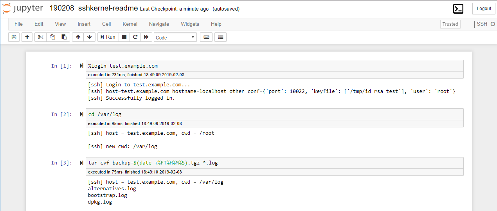

# SSH Kernel

SSH Kernel is a Jupyter kernel specialized in executing commands remotely
with [paramiko](http://www.paramiko.org/) SSH client.



## Major requirements

* Python3.5+
* IPython 7.0+

## Installation

```
pip install -U sshkernel
python -m sshkernel install [--user|--sys-prefix]
# Type `python -m sshkernel install --help` for more information.
```

To uninstall:

```
jupyter kernelspec remove ssh
pip uninstall sshkernel
```

## Getting Started

Basic examples of using SSH Kernel.

* [Getting Started](https://github.com/NII-cloud-operation/sshkernel/blob/master/examples/getting-started.ipynb)
* [Getting Started (in Japanese)](https://github.com/NII-cloud-operation/sshkernel/blob/master/examples/getting-started-ja.ipynb)

## Configuration

SSH Kernel obtains configuration data from `~/.ssh/config` file to connect servers.

Possible keywords are as follows:

* HostName
* User
* Port
* IdentityFile

### Notes about private keys

* As private key files in `~/.ssh/` are discoverable, you do not necessarily specify `IdentityFile`
* If you use a ed25519 key, please generate with or convert into old PEM format
    * e.g. `ssh-keygen -m PEM -t ed25519 ...`
    * This is because `paramiko` library doesn't support latest format "RFC4716"

### Configuration examples

Example1:

```
[~/.ssh/config]
Host myserver
  HostName myserver.example.com
  User admin
  Port 2222
  IdentityFile ~/.ssh/id_rsa_myserver
```

Example2:

```
[~/.ssh/config]
Host another-server
  HostName 192.0.2.1
```

Minimal example:

```
[~/.ssh/config]

# If you specify a FQDN / IP address, same login user, and discoverable private key,
# no configuration needed
```

See also a tutorial above in detail.

## Parameterized run

See [examples/parameterized-notebook](https://github.com/NII-cloud-operation/sshkernel/blob/master/examples/parameterized-notebook.ipynb).

## Limitations

* As Jupyter Notebook has limitation to handle `stdin`,
  you may need to change some server configuration and commands to avoid *interactive input*.
  * e.g. use publickey-authentication instead of password, enable NOPASSWD for sudo, use `expect`
* Some shell variables are different from normal interactive shell
  * e.g. `$?`, `$$`

## LICENSE

This software is released under the terms of the Modified BSD License.

[Logo](https://commons.wikimedia.org/wiki/File:High-contrast-utilities-terminal.png) from Wikimedia Commons is licensed under [CC BY 3.0](https://creativecommons.org/licenses/by/3.0).
